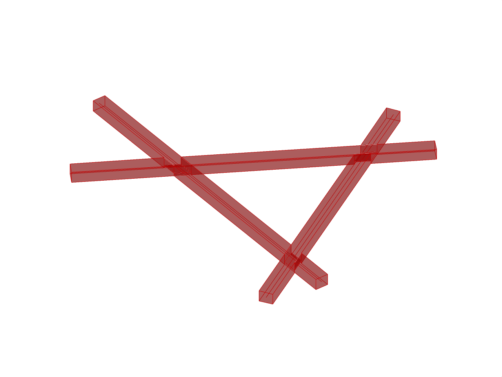

# Assignment 00 (Ungraded)

> Goal: Familiarize yourself with `compas` and `compas_timber` by creating a manually creating a reciprocal frame node of 3 beams with its joints.

### Main Task

Create a simple beam assembly in Rhino using COMPAS Timber:

- Draw 3 lines in Rhino that would be touching or intersecting.
- Use COMPAS Timber to create beams from these center lines (Hint: `Beam.from_centerline()`).
- Add the beams to a `TimberModel`.
- Create 3 joints using `XHalfLapJoint.create`.
- Use `model.process_joinery()` to process the joinery.
- Output the geometry of each beam and use a `Draw` component to visualize.

### Expected Output

A simple reciprocal frame unit with:

- Three beams
- Proper joints at intersections
- Visualization in Rhino

### Resources

- COMPAS documentation: https://compas.dev/compas/latest/
- COMPAS Timber documentation: https://gramaziokohler.github.io/compas_timber/latest/
