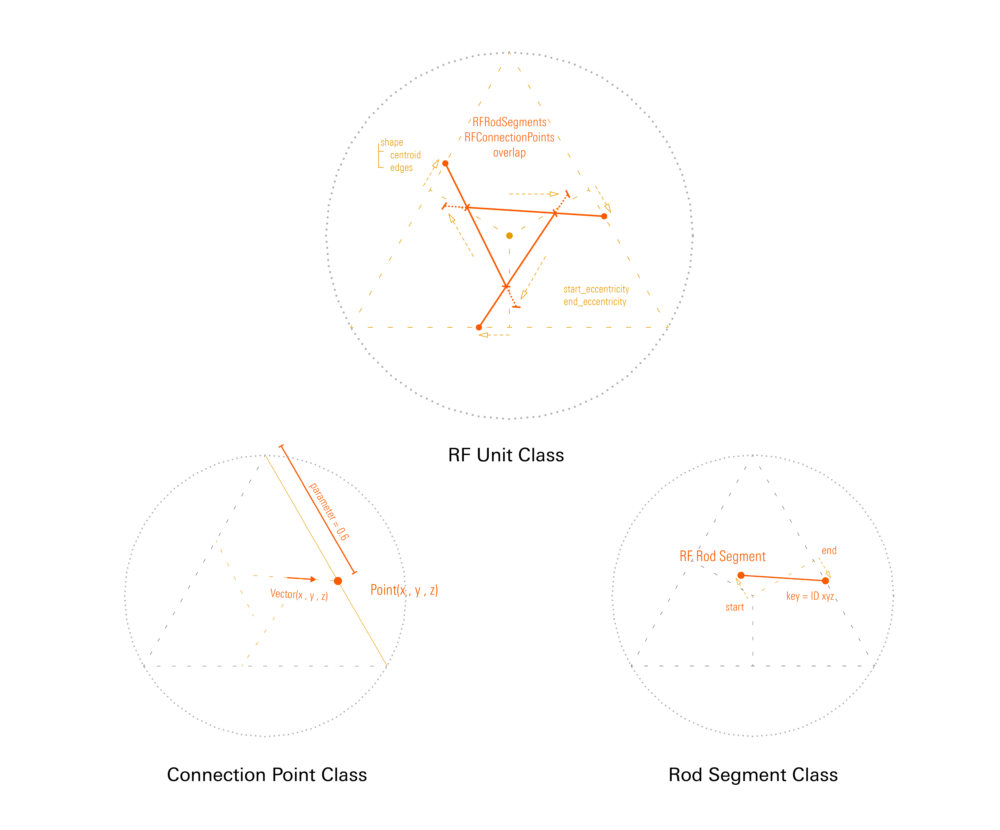
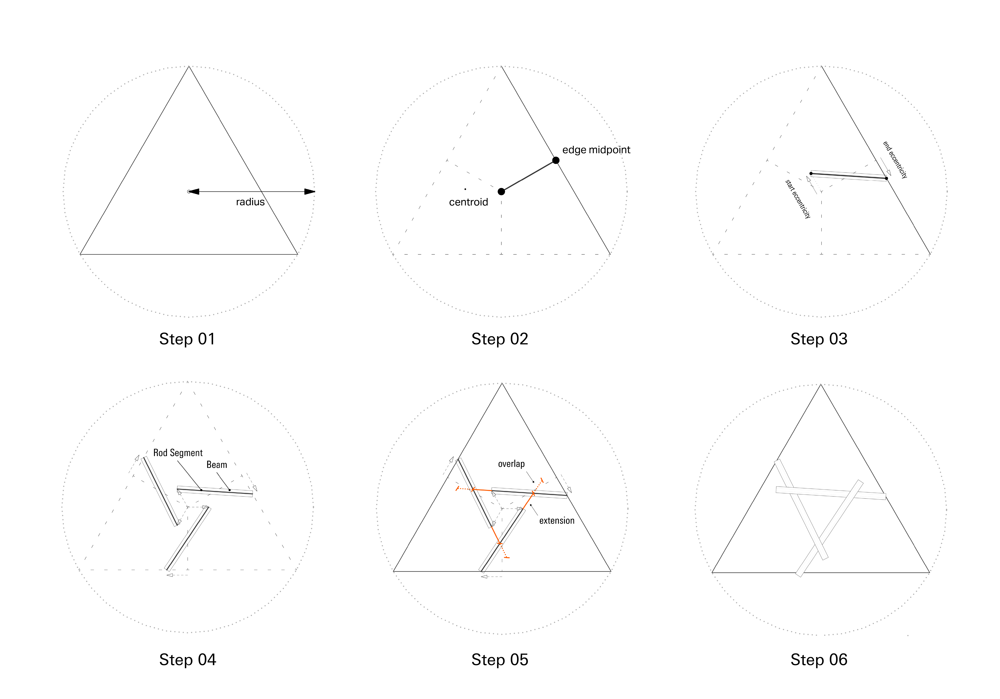
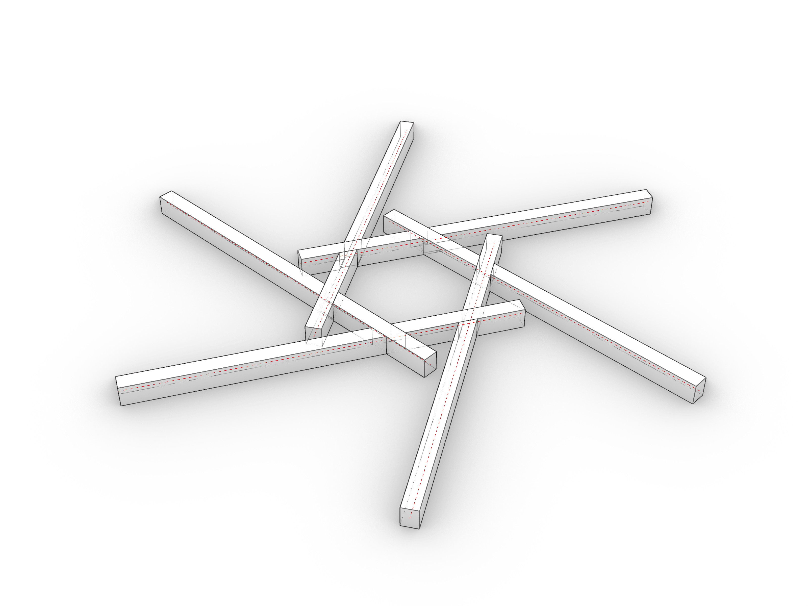

# Assignment 01

> Goal: Create a parametric Reciprocal Frame Unit (`RFUnit`) class that represents the fundamental building block of reciprocal frame structures. An RF Unit is a 2D representation of the closed circuit of rods in an RF Structure. It's enclosed by a polygonal shape and it has exactly one connection point on each of its edges. The assumption of "exactly one connection point per edge" is fundamental to define a consistent interface to these units. Internally, the units could theoretically be any arbitrarely complex set of segments, however, we will limit it to matching segment count to edge count.

Your starting point is the [`a01_rfunits.ghx`](a01_rfunits.ghx) file that contains some components and comments for line-by-line guidance. This line-by-line guidance can be ignored if desired to implement in a different way.

### Main Task

- Create `RFUnit`, `ConnectionPoint` and `RodSegment` classes:
   - `RFUnit`: needs the following constructor arguments: a polygon shape, start eccentricity, end eccentricity and overlap. It should also define computed attributes / properties (hint: using the `@property` decorator), to return centroid and edges, which are the shape's centroid and shape's lines respectively.
   - `ConnectionPoint`: needs the following constructor arguments: a point, a parameter and a vector.
   - `RodSegment`: needs the following constructor arguments: a start and end point. A property to return the line represented by it should also be present.
- Allow to parametrize the unit based on start and end eccentricity
- Visualize the unit's segments and edges in Rhino
- Bonus: allow creation from number of sides + edge length instead of radius
- Topics: Classes, properties, typing (Python 3), Geometry (Vector arithmetics, Line, Polygon)

### Challenge 01

- Control overlap adjustment precisely by making sure the lines are extended by the configured amount only after the intersection point with the other line.
- Topics: Intersections, Geometry (Vector arithmetics, Polygon)

### Challenge 02

- Materialize it with `compas_timber` using the logic of assignment 00 but detect the cycles automatically
- Use two types of connections: TButtJoint and XLapJoint
- Topics: compas_timber model, beams and connections, wrap-around pairing list

## Deliverables

One zip file [`mustermann_max_A-01.zip`] containing:

- Grasshopper File (`.ghx`):
  - File Name: `mustermann_max_A-01.ghx`
  - Optionally, a python file `a01_rfunits_solution.py` containing the solution if you choose to use VS Code.
- Screenshots (`.png`):
  - File Name: `mustermann_max_A-01_xx.png`
  - Dimensions: 3200x2400 px
  - View: Parallel, Shaded

## Submission

Upload the assignment via Moodle.