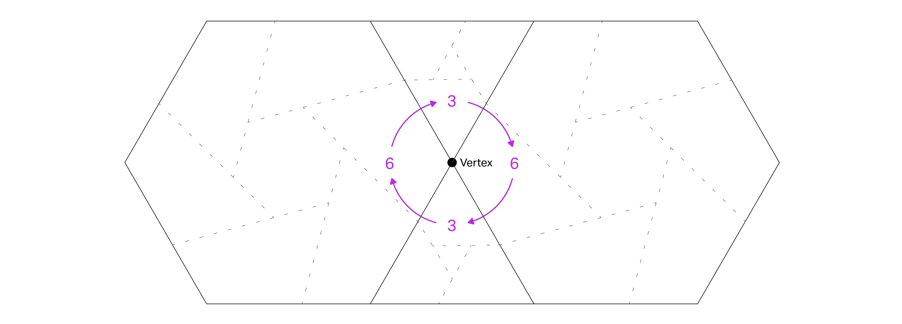
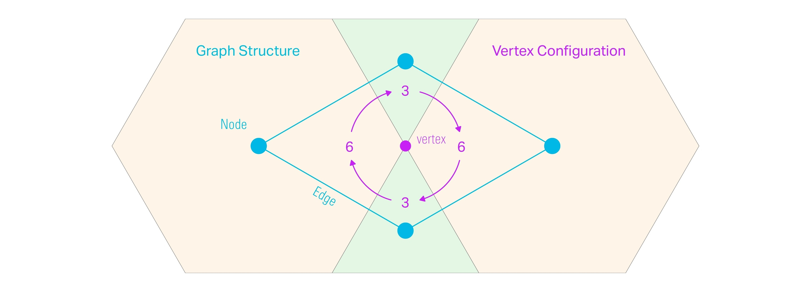
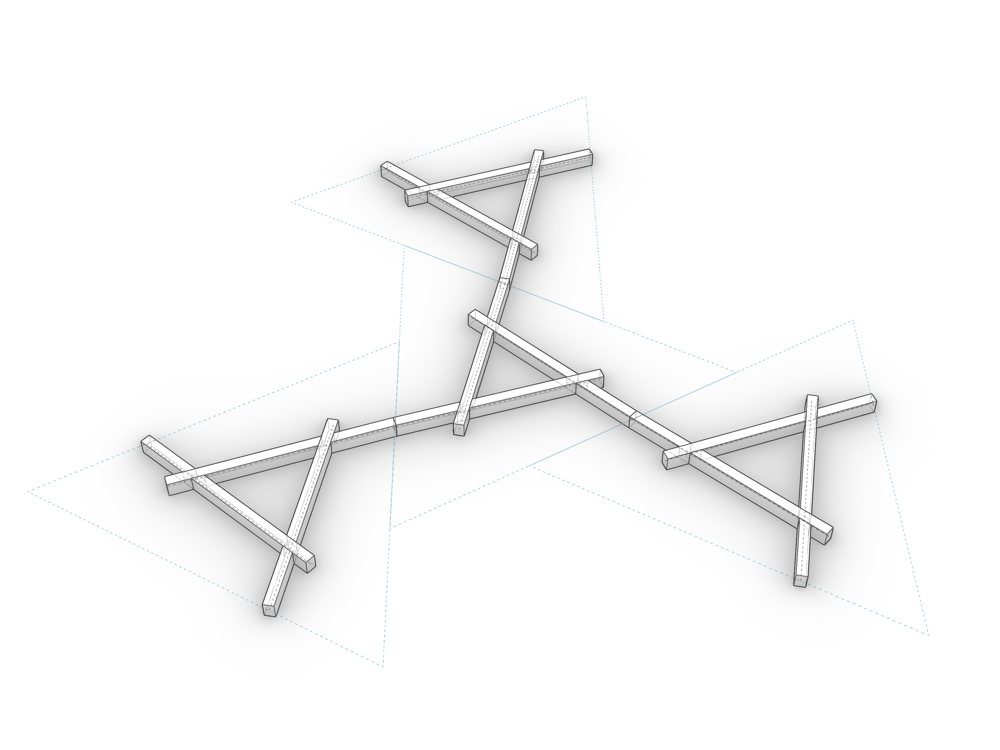

# Assignment 02

> Goal: Create a Reciprocal Frame Tessellation (`RFTessellation`) class that allows to arrange/combine multiple units (`RFUnit` instances) in a congruent tiling layout following one or more grammar rules (`RFGrammarRule` instances).

Your starting point is the [`a02_tessellation.ghx`](a02_tessellation.ghx) file that contains some components and comments for line-by-line guidance. This line-by-line guidance can be ignored if desired to implement in a different way.

### Main Task

- Create an `RFTessellation` class that allows to apply grammar rules to create a 2D tessellation.
- The goal is to implement a method `apply_single_rule_cycle` that applies a single cycle of  rules around a specific vertex.
- The application of rules follows a specific sequence called **Schläfli Notation**, this notation dictates which unit is selected at which stage. Example: In a `6.3.6.3` sequence, the first unit is a triangle, so Unit 1 of the rule will be a triangle, and Unit 2 will be a hexagon. To apply the rule one more time, the newly created hexagon becomes the Unit 1 of the next rule, and the Unit 2 will now be a triangle.
- It is important to select the correct edges for each successive rule application.
- The storage of units created by the rule application, as well as the internal structure of the tessellation will not be a list of `RFUnit` instances, instead, we will use a `compas.datastructures.Graph` that will track not only the units created, but also their connections (as edges of the graph).
- Implement the method to support only SINGLE RULE and a SINGLE CYCLE. That means that the rule will have to be reversed every time we move to the next application. This means that the possible vertex configuration supported are limited to those that have only 2 types of units and can be sequenced with the simple reversal/alternation of the rule.

- Details:
  - To ease tracking, add an attribute `key` to the `RFUnit` class created before.
  - Create a `Graph` on initialization. Each time we add a unit, we will create a graph node with the unit instance as its data.
  - Implement a `@property` called `units` to access the units stored in the edges of the graph.
  - Implement the `apply_single_rule_cycle` method that iteratively:
    - Gets the next available edge of unit 1
    - Applies the rule to create a new unit.
    - Add the new unit to the graph following these steps:
      - Update the `key` of the newly added unit to the one that graph returns when adding a new node.
      - Add a node attribute `connected_shape_edges` as a list containing the shape edge that was connected. This will always be 0 because we start connecting on the 0 edge of the new unit.
      - Update the `connected_shape_edges` node attribute of the unit 1, to reference the edge that was connected.
      - Add a graph edge between unit 1 and the new unit.
    - Check if we completed the cycle and exit/return if so
    - Prepare the next rule. For convenience, you might want to write a method `reversed` on the `RFGrammarRule` class that creates a reversed rule.
- Topics: Classes, properties, graphs (`compas.datastructures.Graph`), Geometry (Vector arithmetics, Line, Polygon)

### Challenge 01

- Implement a mechanism to detect when a cycle has been completed and the application of rules loops back into an existing unit.
- Detecting if a new unit is looping back into ANY other unit is complex, we need to follow a few steps:
  - For all the free edges of the newly created unit
  - Compare each connection point to the closest connection point of any other existing unit. To do this, collect all other connection points and sort them first.
  - If the closest (first) connection point is at a `distance=0` of the connection point of the newly created unit, it means there's a cycle: add the edge and corresponding node attributes updates (`connected_shape_edges`) to keep track of it all.
- Topics: Graphs.

### Challenge 02

- Create a second, more advanced method to apply rules in the tessellation, and this time allow more than one rule to be define. This extend the possible vertex configurations supported to a more complex set, allowing 3 or more units, and non-alternating sequences.

- Details:
  - Create a vertex pair iterator based on the schläfli notation (vertex configuration), that will return vertices in pairs (infinitely, using the generator/iterator pattern of Python).
  - Create a dictionary of rules based on their vertex pair, so that we can look them up quickly during application.
  - During application, select the next vertex pair from the iterator, locate a rule that matches that, and prepare it for application.
- Topics: generator/iterators.

## Deliverables

One zip file [`mustermann_max_A-02.zip`] containing:

- Grasshopper File (`.ghx`):
  - File Name: `mustermann_max_A-02.ghx`
  - Optionally, a python file `a02_tessellation_solution.py` containing the solution if you choose to use VS Code.
- Screenshots (`.png`):
  - File Name: `mustermann_max_A-02_xx.png`
  - Dimensions: 3200x2400 px
  - View: Parallel, Shaded

## Submission

Upload the assignment via Moodle.