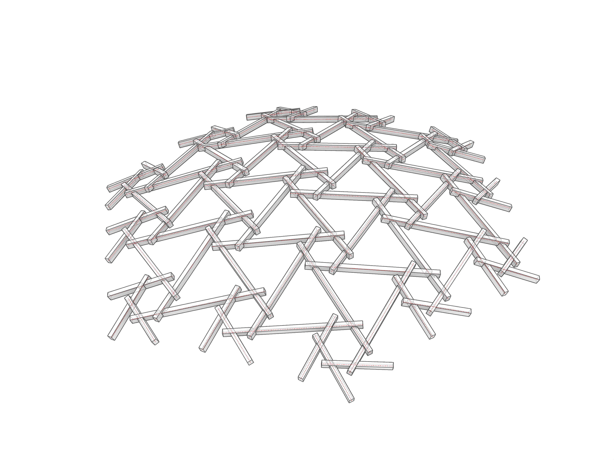
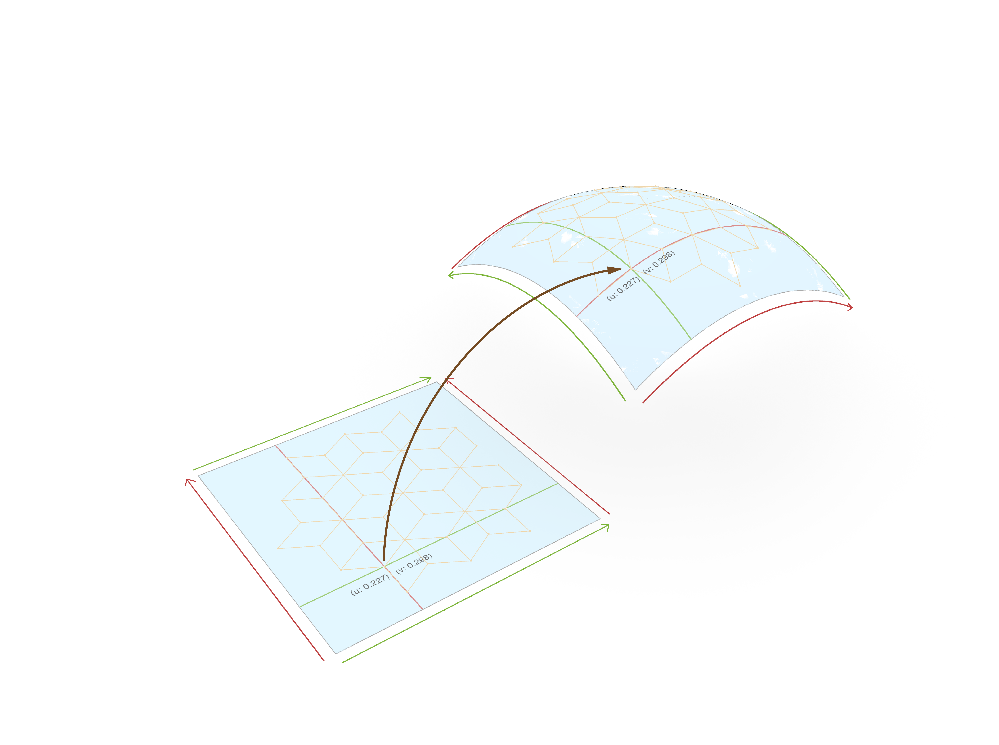
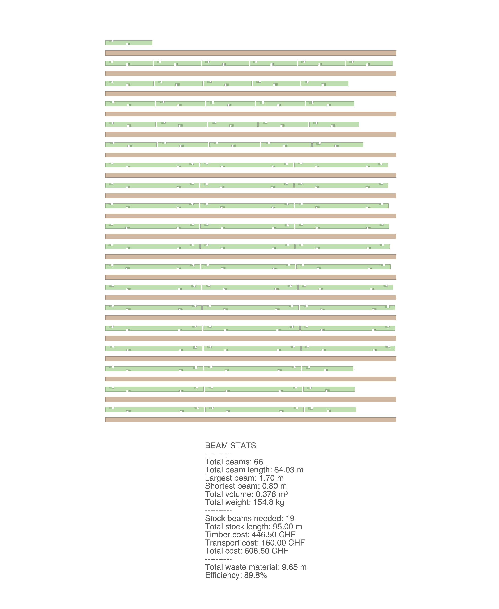
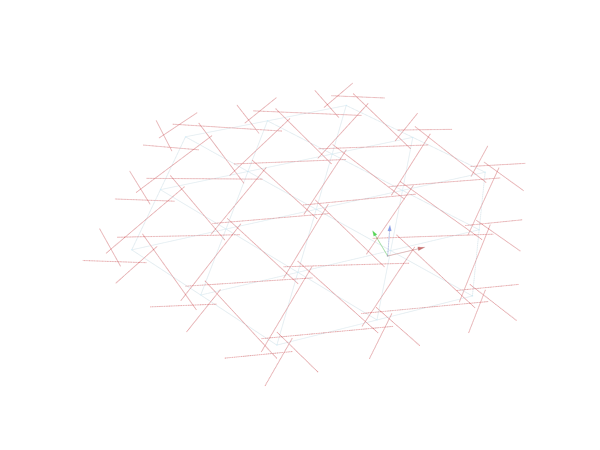

# Assignment 03

> Goal: Map the 2D tessellation -including all of its parts (units, segments, rods, beams)- to a 3D surface that will eventually become the final design.

Your starting point is the [`a03_lift_solution.ghx`](a03_lift_solution.ghx) file and the [`a03_lift_solution.py`](a03_lift_solution.py) file. The Grasshopper file contains some components but the large majority of the assignment code should be written in the Python file, which also contains comments for line-by-line guidance. This line-by-line guidance can be ignored if desired to implement in a different way.
Both files contain the markers `[..ADD YOUR CODE HERE..]` to indicate where you should add your code to complete the assignment.

### Main Task

- Add methods to the `RFTessellation` class to map the 2D tessellation to a 3D surface.
- The method should accept two arguments: a source surface and a target surface. The source surface is expected to be planar, the target surface can be anything.
- You will rely on the fact that the class now has a `.tessellate()` method that expands the single-cycle tessellation so the tessellation cover bigger areas of the plane.
- You will apply a UV mapping technique to relate the UV space of the source surface (which overlaps with the 2D tessellation) with the UV space of the target surface.
- Topics: UV mapping

### Challenge 01

- Write an algorithm to determine how many stock beams (each has a length of 5m) are required to build the structure. Minimize the waste by packing as many beams as possible in each stock beam, this also determines how each stock beam will be cut.
- Once you have determined how to cut the stock beams into your structure's beams, you can now visualize the beams, as well as, the stock beams, laying them out on a surface.
- Bonus: assume a gap/buffer between each beam to ensure they can be cut correctly. 
- Topics: 

### Challenge 02

- Add the possiblity of using an attractor point or curve to control local parameters of the tessellation.
- For example, alter the start eccentricity of units based on the distance between their centroids and the attractor point/curve.
- Bonus: detect units on the boundary and apply a local effect on them (e.g. set eccentricity to zero).
- Topics: attractors

## Deliverables

One zip file [`mustermann_max_A-03.zip`] containing:

- Grasshopper File (`.ghx`):
  - File Name: `mustermann_max_A-03.ghx`
  - Optionally, a python file `a03_lift_solution.py` containing the solution if you choose to use VS Code.
- Screenshots (`.png`):
  - File Name: `mustermann_max_A-03_xx.png`
  - Dimensions: 3200x2400 px
  - View: Parallel, Shaded

## Submission

Upload the assignment via Moodle.