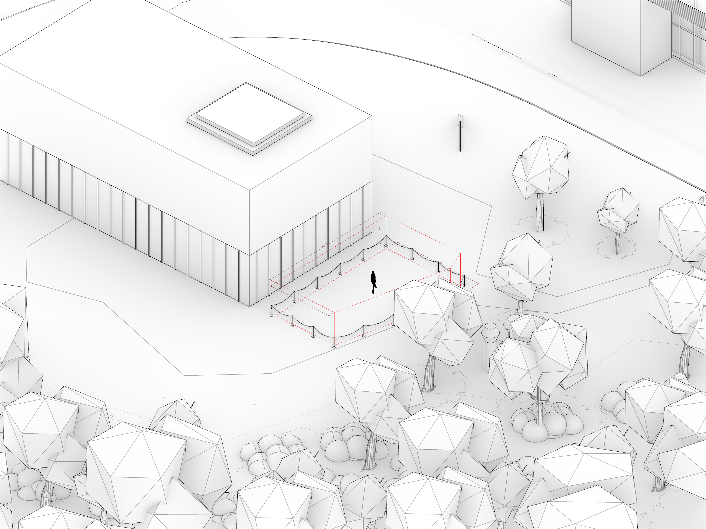

# Final project

> Goal: design a reciprocal frame structure located next to the 
[HIN building at ETH Hönggerberg](https://ethz.ch/en/campus/access/hoenggerberg.html) 
 using the knowledge gained during the previous assignments this semester.

## Project Overview

Use Python programming to design a reciprocal frame timber structure based
on the classes implemented during the semester (`RFUnit`, `RFGrammarRule`,
`RFTessellation`, etc). The design of the structure should be materialized
as a timber model, including beams and joints, and should be fabricatable 
(eg. contain no collisions between beams) using a CNC machining process.

The RF structure is to be placed in at the ETH Hönggerberg, next to
the **HIN building** (Zero Carbon Building Systems Lab).

The submitted projects will be evaluated for 
fabricability and aesthetics, and one of them will be
selected to be fabricated and assembled in real life.

### **Organization**

This is a Group Project. You can form groups of up to three students, or work alone if you prefer. Please select a group on the main page on Moodle

### **Site**

 * **HIN building** (Zero Carbon Building Systems Lab), ETH Hönggerberg
 * Area: approx. 63 m2
 * Max height: 2.5m
 * [Link to Map](https://maps.app.goo.gl/XkUaAZL1iQzD6Pyh9)
 * [Rhino file](a04_design_base-file.3dm)

---

## Required tasks

The following tasks are required to complete the final project
successfully. Completing them correctly awards 4 grade points.
The maximum grade for this assignment is 6 points. The remaining
2 points can be obtained by completing the extra tasks.

The starting point for the project is the [`a04_design_base-file.3dm`](a04_design_base-file.3dm) file, the [`a04_design_solution.ghx`](a04_design_solution.ghx) file and the [`a04_design_solution.py`](a04_design_solution.py) file.

### 1. Project presentation: poster in PDF

Prepare a single-page poster showcasing the project and the outputs of your code.

Guidelines:

- Brief description of your design intent. Can highlight concept, challenges faced, and discoveries made during the project.
- Consider including small snippets of interesting code used in the creation of the project. Code should be formatted in a monospaced font.
- Main image of the project and optionally large side image. 
- Optionally additional diagrams or images of the project to complement the textual description.
- Use Landscape orientation

See [InDesign template poster for reference](a04_layout_template.indd). The template uses the `Roboto` font, which is available for free. It can be installed using Google Fonts, or download it from this repo and install directly from the [zip file](./_resources/roboto_font.zip).

### 2. Create an RF structure design and map it to a target surface on-site.

Use the classes for RF structure design we developed in class during the semester & assignments, and map the resulting tessellation onto a final surface placed on the site indicated above. The mapping of the surface also requires a source surface to act as reference.

Use the Optimization section to gain precise control over the placement of each beam, if needed.

## Extra tasks

The following tasks are not mandatory, but allow you to exercise more the skills you have acquired. Each task grants between 0.25 and 1 grade points. The maximum grade for the final project is 6 points. If all required and extra tasks are completed successfully, the maxium grade of 6 will be awarded.

### 1. Attractor-based adjustments (0.25pt)

Use an attractor point or curve to adjust one or more parameter of the structure, for example, modify the start eccentricity of the units based on the distance to the attractor, as done in A03.

### 2. Surface-curvature-based adjustments (0.25pt)

Similar to the attractor-based adjustments, but instead of attractors, use the curvature of the target surface to adjust local parameters of the structure. Unlike the attractor-based adjustments, this one would need to take place at a later stage in the pipeline, at the point of/or after the UV mapping, which changes the possible parameters that can be adjusted (consider that regenerating segments at this point cannot be done without significant reassignment of other data).

### 3. Fabricability checks: minimum eccentricity radius (0.25pt)

Add a check to ensure that the minimum eccentricity radius is not exceeded.
Units with a very small inner radius are very likely to be unmanufacturable, or impossible to assemble.

### 4. Fabricability checks: ensure no collisions that are not joints (0.5pt)

Add a check to ensure that no two beams intersect, except those for which a joint exists.

### 5. Fabricability checks: minimum and maximum beam length (0.25pt)

Add a check to ensure that the minimum and maximum beam length are not exceeded. The minimum length of beams is 60cm, and the maximum is 200cm.

### 6. Design a boundary (1pt)

Design a boundary for the structure, either based on a ring, or based on a extending beams to the ground. You might also create a primary or secondary structural system, to hold the RF structure. Keep in mind structural stability and fabricability if you choose to create an additional system.

### 7. Add metrics (0.25pt)

Add one or more metrics that utilize the timber model to extract information, for example, calculate CO2 emmissions of the material in your structure (use 90 CO2m/m3 per kg of timber).

### 8. Integrate other joint types in your design (0.25pt)

Integrate other joint types in your design, for example, T-Butt joints, either assignming them per unit, or per segments, or any other way that allows you to play with options of using other joint types.

### 9. Roof cladding (1pt)

Develop a roof cladding system for the reciprocal frame structure. You'll need to think about the geometry of the structure, and how to attach the cladding to the structure.

### 10. Assembly sequencing (1pt)

Leverage the algorithms available for graphs in COMPAS, to determine an ordering of beams that allows for a sequential assembly of the structure. 

For example, use `compas.topology.breadth_first_ordering` to get a sequencial order of beams starting from the most central unit.

### 11. Add a cut plane to trim the entire structure (0.5pt)

If it makes sense for your structure Use the features of `compas_timber` to add a cut plane to trim the entire structure. The cut plane can be as a horizontal plane that is parallel to the ground.

## Deliverables

One zip file (`mustermann_max_A-04.zip`) containing:

- Grasshopper File (`.ghx`):
  - File Name: `mustermann_max_A-04.ghx`
- Rhino File (`*.3dm`):
  - File Name: `mustermann_max_A-04.3dm`
  - Bake building into Rhino: `yes`
- Python (`*.py`):
  - File Name: `a04_design_solution.py`
- Short project presentation / poster (`pdf`):
  - File Name: `mustermann_max_Final_Project.pdf`
- Project images (minimum 1) (`png`):
  - File Name: `mustermann_max_Final_Project_01.png`
  - Dimensions: 3000x2400px
  - View: Perspective - rendered
  - Background: white without grid axes and grid

## Submission

Upload the assignment via Moodle.