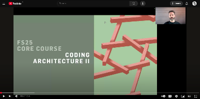

# Getting Started

## Software requirements

Before you begin the installation of the tools required for this course, make sure you have the following pre-requisites installed on your system:

* Rhino 8: https://www.rhino3d.com/download
* VS Code (free): https://code.visualstudio.com/
* GIT (free): https://git-scm.com/

> NOTE: On Mac, GIT is usually pre-installed, you do not need to install again. To check if it is installed, open a terminal window and type `git`, if the result does not indicate any error, it means you already have it in your system.

Once that is done, follow the step-by-step instructions of the video below to install the rest of the tools.

## Installation guide

The installation on Rhino 8 is significantly simpler nowadays. Just copy&paste the following code snippet in a `Python 3 script` component in Grasshopper:

```python
# r: compas>=2.9
# venv: ca_fs25

import compas
print(f"Hello COMPAS {compas.__version__}")
```

Additionally, it is highly recommended to follow a few extra steps to install Visual Studio Code and a separate conda environment, in order to leverage modern software development tooling. 

Clone the following git repository:

    https://github.com/gramaziokohler/coding_architecture_fs25.git

Install a new conda environment:

    conda env create -f https://dfab.link/ca_fs25.yml

**Step-by-step video**

Click [here](https://youtu.be/AfSPShslrIQ) to watch the installation guide video:

[](https://youtu.be/AfSPShslrIQ)
