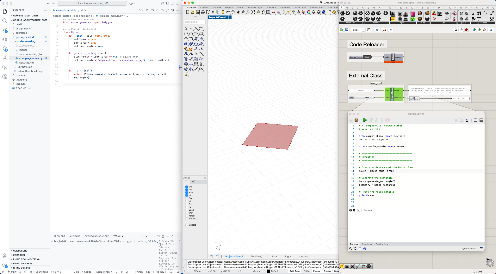
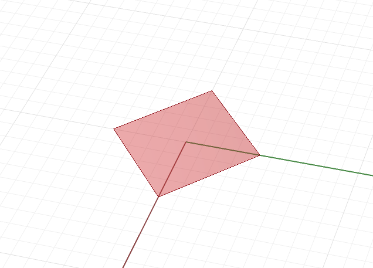
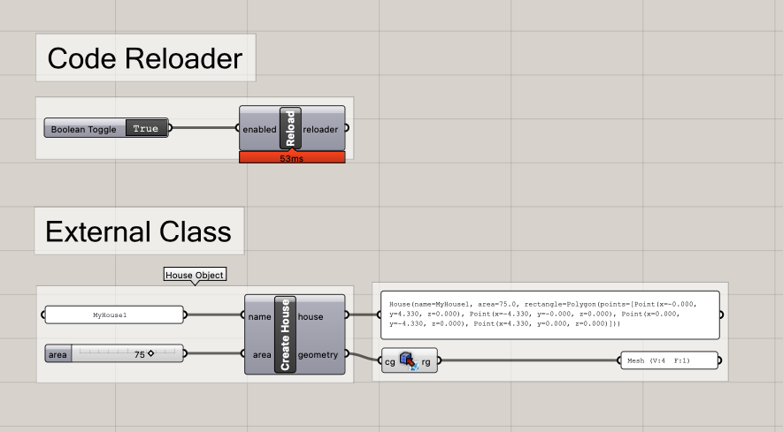
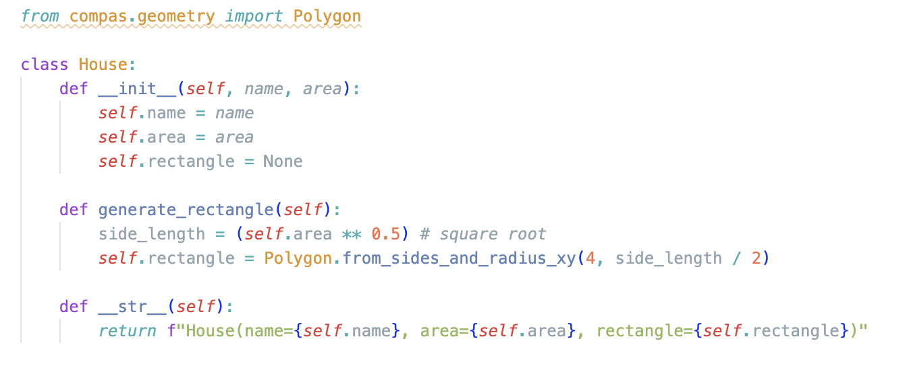

# Code Reloading with VS Code


## Overview

This guide explains how to develop for Grasshopper by writing code in VS Code and dynamically loading it into Grasshopper. The benefits among many are:

- **VS Code benefits**: Powerful code editing, IntelliSense autocompletion, AI assistance with GitHub Copilot, proper debugging tools, and version control

**Important**: When submitting assignments using this method, always include both the .ghx file and the .py file.

<!--  -->


## Setup Instructions

Follow these steps to create a development workflow between VS Code and Grasshopper:

1. **Enable Code Reloading in Grasshopper**
   - Add a new Python component to your Grasshopper canvas
   - Create a Boolean toggle input named `enabled` to control the reloader
   - Paste the following code:

    ```python
    from compas_rhino.devtools import DevTools
    if enabled:
        DevTools.enable_reloader()
    else:
        DevTools.disable_reloader()
    ```

2. **Save Your Grasshopper Project**
   - Save your Grasshopper project as a .ghx file in a directory of your choice (e.g. `code_reloading.ghx`)

3. **Create Your Python Class File**
   - In the same directory as your .ghx file, create a new .py file (e.g., `example_module.py` or `my-custom-class.py`)
   - Open this file in VS Code to write your class implementations
   - VS Code will provide syntax highlighting, code completion, and other helpful features

4. **Implement Your Class**
   - Define your classes and methods in VS Code
   - Take advantage of VS Code's IntelliSense and Github Copilot.

        

5. **Load Your Code in Grasshopper**
   - Create another Python component in Grasshopper
   - Use the following commands to load the python file
        ```python
        # r: compas>=2.9, compas_timber
        # venv: ca-fs25

        from compas_rhino import DevTools
        DevTools.ensure_path()

        from code_reloading import House
        ```
   - Interact with your class
        ```python
        # Create an instance of the House class
        house = House(name, area)

        # Generate the rectangle
        house.generate_rectangle()
        geometry = house.rectangle

        # Print the house details
        print(house)
        ```

6. **Development Workflow**
   - Make changes to your Python code in VS Code
   - Save the file
   - The reloader will pick up immediately and your will be reflected as soon as a component runs again.
   - If you want to make sure all components make use of your latest changes, recompute the canvas.

## Example Files

We have prepared a simple example that demonstrates this workflow:

- [code_reloading.ghx](./code_reloading.ghx): Grasshopper definition with the necessary components
- [example_module.py](./example_module.py): Python file containing a basic `House` class

Try modifying the `House` class in VS Code and observe how the changes appear in Grasshopper when you reload.
